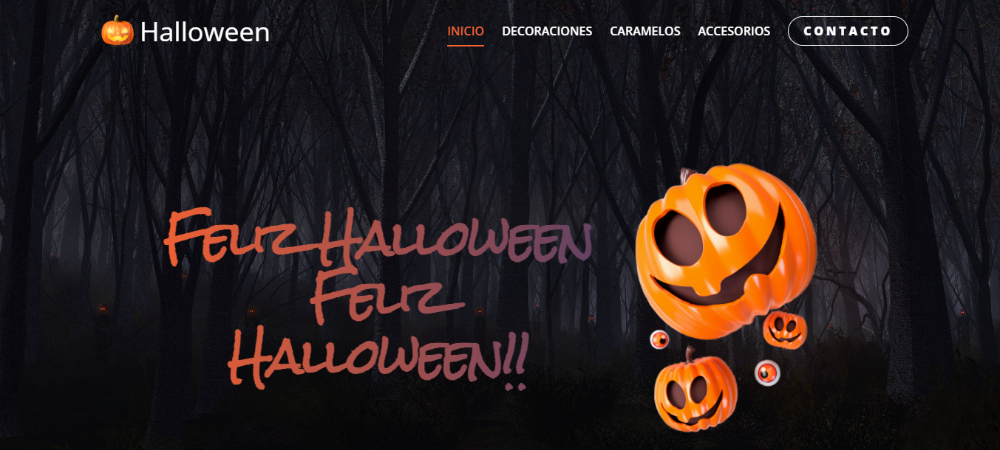
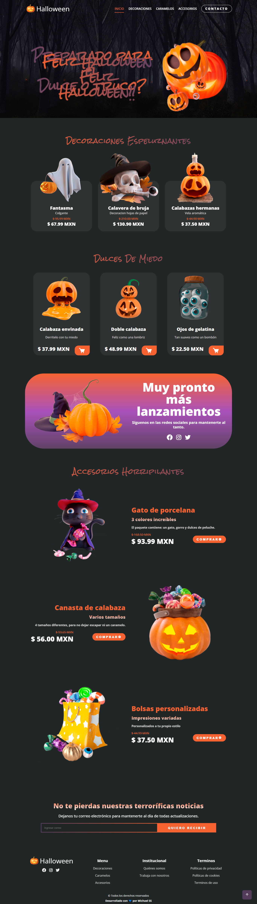

#   Sitio web Halloween version 2022

Sitio web responsivo con tematica de halloween

## Tecnologías usadas en este proyecto: HTML, CSS y JavaScript

## [Iconos](https://boxicons.com/usage)
Boxicons es un  sitio que permite el uso de vectores(iconos) de manera gratuita y de paga.

## [Animaciones](https://unpkg.com/scrollreveal)
Scrollreveal es una libreria para crear animaciones(transiciones y transformaciones) en conjunto con CSS.

## [Vista](https://michael-ss-halloween-v2022.netlify.app/)

    

## Full-Page

    

